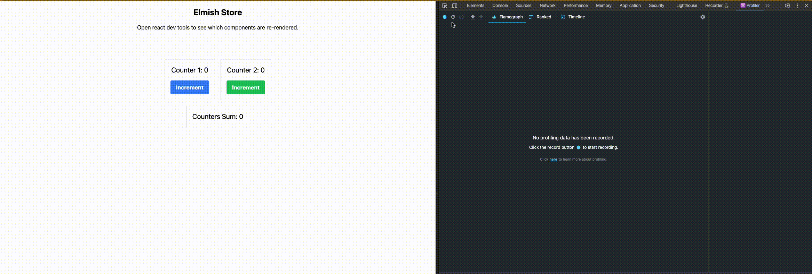

# Elmish Store

> 📣 **Coming Soon:** A comprehensive blog post detailing the Elmish Store project! Stay tuned for an in-depth look at how this library enhances F# and React integration. 🚀

A library that merges Elmish with React, offering an external store for efficient and selective component rendering.

This project is designed to tackle two primary challenges commonly faced when integrating Elmish and React:
- **Props Drilling:** Avoiding the complexities of passing data through multiple layers of components.
- **Excessive Rendering:** Minimizing unnecessary component renders often caused by passing the entire model from the top down.

Elmish Store addresses these issues by enabling more targeted data management and rendering, leading to cleaner code and improved performance.

## Usage

The package consists of two parts:
- **Creating the store:** Functions that accept the user's program definition and create a store consumable by custom React hooks.
- **Selectors:** Custom hooks that allow selecting parts of the model with the assurance that components will re-render only if the selected part changes. These come in two variants:
  - `useSelector`: This expects a stable selector function and uses reference equality to compare the results with the previous one.
  - `useSelectorMemoized`: This expects any kind of function. It leverages `React.memo` to store the previous selector result and compares it with the new one depending on the chosen equality mode:
    - Generic `equality` constraint
    - Custom `isEqual` function

## Example

### Store Definition + Selector Helpers:

```fsharp
open Elmish
open ElmishStore
open ElmishStore.Example.Model
open Feliz

#if DEBUG
open Elmish.Debug
#endif

let store =
  Program.mkProgram init update (fun _ _ -> ())
  #if DEBUG
  |> Program.withConsoleTrace
  |> Program.withDebugger
  #endif
  |> ElmishStore.createStore "main"

[<Hook>]
let useSelector (selector: Model -> 'a) = React.useElmishStore (store, selector)

[<Hook>]
let useSelectorMemoized (memoizedSelector: Model -> 'a) =
  React.useElmishStoreMemoized (store, memoizedSelector)

let dispatch = store.Dispatch
```

### Usage in components:

```fsharp
[<ReactComponent>]
let private Counter1 () =
  let counter = ModelStore.useSelector (_.Counter1) // only rerenders if Counter1 changes

  Html.div [
    prop.className "border flex flex-col items-center justify-center gap-4 p-4"
    prop.children [
      Html.span [
        prop.className "text-xl"
        prop.text $"Counter 1: %i{counter}"
      ]
      Html.button [
        prop.className "bg-blue-500 hover:bg-blue-700 text-white font-bold py-2 px-4 rounded"
        prop.onClick (fun _ -> Increment1 |> ModelStore.dispatch)
        prop.text "Increment"
      ]
    ]
  ]

[<ReactComponent>]
let private CounterSum () =
  // Function generating a new tuple each time. It uses F# built-in equality compare function.
  let counter1, counter2 = ModelStore.useSelectorMemoized (fun m -> (m.Counter1, m.Counter2))
  Html.div [
    prop.className "border p-4 text-xl"
    prop.text $"Counters Sum: %i{counter1 + counter2}"
  ]
```

This GIF illustrates the example (notice how React DevTools reflects re-rendering based solely on selector state changes):



For a comprehensive understanding, explore the `ElmishStore.Example` directory within this repository.
